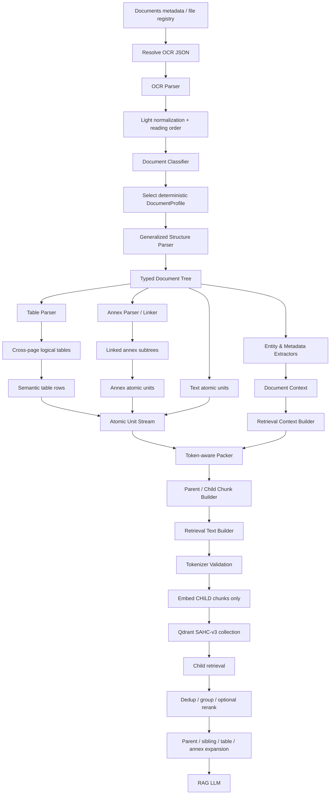

# CHUNKING V3 — SAHC-v3 MULTI-DOCUMENT VIETNAMESE ADMINISTRATIVE CHUNKING SPECIFICATION FOR CODEX

> **Internal name:** SAHC-v3  
> **Meaning:** Structure-Aware Hierarchical Chunking v3  
> **Status:** Implementation specification / source of truth for v3  
> **Supersedes:** `CHUNKING_V2_CODEX_SPEC.md` for the v3 implementation path; v2 remains a benchmark/baseline.  
> **Primary scope:** Vietnamese OCR documents: `DECISION`, `CONTRACT`, `PROPOSAL`, `OFFICIAL_LETTER`, plus linked `ANNEX` subdocuments.  
> **Execution constraint:** Deterministic chunking; **no LLM API call is permitted in the chunking execution path**.

---

## 0. Purpose and design intent

SAHC-v2 established the correct architectural direction for OCR-based Vietnamese administrative documents:

```text
OCR JSON
→ normalize layout blocks
→ reconstruct document structure
→ reconstruct cross-page tables
→ create semantic atomic units
→ token-aware packing
→ create parent/child chunks
→ build retrieval text
→ embed children
→ store in Qdrant
→ retrieve children
→ expand parent/siblings
```

SAHC-v3 keeps that pipeline but removes the assumption that a document is primarily a **Quyết định** whose dominant semantic boundary is `Điều`.

The v3 objective is:

> **Parse the document according to a deterministic document profile, construct a typed document tree, preserve tables/annexes/entities, and only then pack semantic units into tokenizer-safe parent/child chunks.**

The same engine must support documents whose natural hierarchy is different:

- **Quyết định** — preamble/legal basis → decision body → `Điều` → `Khoản`/`Điểm` → recipients/signature;
- **Hợp đồng** — recitals/legal basis → multi-party identity blocks → `Phần/Chương/Mục/Điều/Khoản/Điểm` → commercial/technical terms → signatures → annexes;
- **Tờ trình** — recipient/target approver → rationale/legal basis → semantic proposal sections → Roman/numeric/alphabetic hierarchy → recommendations → enclosed materials/signature;
- **Công văn** — metadata + `V/v` subject → `Kính gửi` → body/action/response → optional numbered subsections → `Nơi nhận` → signature;
- **Phụ lục** — linked subdocument with its own text/table hierarchy and explicit relationship to a parent document or parent section.

### 0.1 The five non-negotiable principles

The user request refers to “4 principles” but explicitly lists five requirements. SAHC-v3 treats **all five** as mandatory:

1. **Structure-Aware** — parse the document tree before chunk packing; never treat the whole document as an undifferentiated character string.
2. **Table-Aware** — reconstruct HTML tables, merge deterministic cross-page continuations, and serialize rows semantically.
3. **Parent/Child Architecture** — small children for high-precision retrieval; broader parent/sibling context for generation.
4. **Token-Aware Packing** — use the real embedding tokenizer and forbid silent truncation.
5. **Deterministic Execution** — no LLM-based boundary detection, classification, OCR correction, or routing during chunking.

### 0.2 Research basis and interpretation

The parsing taxonomy in this specification uses two kinds of evidence:

- **Normative administrative formatting evidence:** Nghị định 30/2020/NĐ-CP and its appendices define administrative-document presentation components and templates. This supports robust detection of metadata regions, document names, subject lines, recipient/signature/distribution regions, and common administrative layout conventions.
- **Observed/semantic document conventions:** official Tờ trình, Công văn and Hợp đồng examples show recurring semantic headings such as `Kính gửi`, `Sự cần thiết`, `Bên A/B`, `Điều`, `Nơi nhận`, and multi-level numbering. These are implemented as deterministic **heuristics and aliases**, not as a claim that every document is legally required to use the same internal semantic headings.

For contracts specifically, the Civil Code allows contract content to consist of agreed terms such as subject matter, quantity/quality, price/payment, time/place/method of performance and other terms. Therefore v3 must not assume one universal contract section order; it must parse **structural markers** and preserve flexible clause titles.

---

# 1. Executive Summary & Pipeline Architecture

## 1.1 High-level workflow



## 1.2 Classification is an early routing layer, not an LLM router

The new deterministic layer is:

```text
normalized OCR blocks
        │
        ▼
DocumentClassifier
        │
        ├── DECISION
        ├── CONTRACT
        ├── PROPOSAL
        ├── OFFICIAL_LETTER
        └── UNKNOWN
        │
        ▼
DocumentProfile
```

`ANNEX` is modeled primarily as a **document role / linked subdocument**, not as a mutually exclusive root `doc_type`. A standalone annex may have:

```json
{
  "doc_type": "UNKNOWN",
  "document_role": "ANNEX"
}
```

or inherit the root document type after deterministic linking.

## 1.3 Core design change from v2

v2 effectively had this structural assumption:

```text
DOCUMENT
├── METADATA
├── PREAMBLE
├── DECISION
│   ├── ARTICLE
│   ├── ARTICLE
│   └── ARTICLE
├── RECIPIENTS
└── SIGNATURE
```

v3 uses a generalized tree:

```text
DOCUMENT
├── HEADER / METADATA
├── PREAMBLE / RECITALS / RECIPIENTS_TARGET
├── PARTY_BLOCK*                      # contract profile
├── SECTION(level=0..n)
│   ├── SECTION(...)
│   │   ├── PARAGRAPH
│   │   ├── TABLE
│   │   └── LIST_ITEM
│   └── ...
├── ANNEX*
│   ├── SECTION*
│   └── TABLE*
├── DISTRIBUTION / ENCLOSURES
└── SIGNATURE_BLOCK*
```

`ARTICLE`, `CLAUSE`, `POINT`, `ROMAN_SECTION`, `NUMERIC_SECTION`, etc. remain **typed nodes**, but all are produced through one structural-marker registry and profile-aware stack parser.

---

# 2. Document Structural Mapping Matrix

| Structural element | Quyết Định (`DECISION`) | Hợp Đồng (`CONTRACT`) | Tờ Trình (`PROPOSAL`) | Công Văn (`OFFICIAL_LETTER`) | v3 node / treatment |
|---|---|---|---|---|---|
| Issuing organization | Usually top-left header | May be organization header or party identity | Usually top-left header | Usually top-left header | `metadata` + extracted `issuer` |
| National heading / date | Common administrative layout | Common in many Vietnamese contracts but not guaranteed | Common | Common | `metadata`, not primary semantic child |
| Document number | `Số: .../QĐ-...` | Contract number may appear near title | `Số: .../TTr-...` | `Số: .../...` | `document_number` |
| Document title/type | `QUYẾT ĐỊNH` | `HỢP ĐỒNG ...` | `TỜ TRÌNH` | Often **no literal `CÔNG VĂN` title** | strong classifier evidence |
| Subject / trích yếu | Under title | Contract title/subject | `Về việc ...` | `V/v ...` is a strong signal | `subject` / `summary` |
| `Kính gửi:` | Rare/usually not body core | Sometimes absent | Strong target-approver boundary | Strong recipient boundary | `recipient_block` / entity extraction |
| Legal basis / recitals | `Căn cứ...`, `Theo đề nghị...` | `Căn cứ...`, `Xét rằng...`, recitals | `Căn cứ...`, legal rationale | May appear in opening body | `legal_basis` / `recital` atomic units |
| Party identification | Not applicable | `Bên A`, `Bên B`, `Bên C`... | Not applicable | Not applicable | `party_block` + party entities |
| Top hierarchy | Sometimes `Chương` | `Phần`, `Chương` possible | `I.`, `II.`, `A.`, `B.` common | Usually prose; may have `I.`/`1.` | profile-aware `section` |
| `Mục` hierarchy | Possible | Common in complex contracts | Possible but less uniform | Possible | `section(kind="muc")` |
| `Điều` hierarchy | Primary | Very common | Possible in attached draft, less common in Tờ trình body | Usually references rather than own sections | `article` only when boundary confidence passes |
| `Khoản` / `1.` | Under Điều | Common | Common as body subsection | Common for action lists | `clause` / `numeric_item` |
| `Điểm` / `a)` | Under Khoản | Common | Common | Common | `point` |
| Decimal numbering | Occasional | `1.1`, `1.2`, `2.1` common | Can appear | Can appear | `decimal_clause` with inferred depth |
| Main semantic sections | decision articles | payment, rights, obligations, acceptance, warranty, dispute, effect... | necessity, legal basis, proposal content, recommendation... | request/action/response paragraphs | semantic heading aliases only at line/block boundary |
| Table body | decisions, lists | pricing, BoQ, payment schedule, technical specs | budget/options/comparison | occasional lists/statistics | table parser + semantic rows |
| `Nơi nhận:` | Strong terminal boundary | uncommon; contract has party signatures instead | possible | Strong terminal boundary | `recipients` / `distribution` |
| Signature | signer + role | multiple party signature columns | approving/submitting signer | signer + role | `signature_block`, possibly multi-column |
| `Tài liệu kèm theo` | possible | attachments/annexes | common enclosure list | possible | `enclosure_list` |
| `Phụ lục` | possible | very common and semantically important | possible | possible | linked `annex` subdocument |
| Cross-page table | possible | common in technical/price annexes | possible | occasional | logical table reconstruction |

### 2.1 Important interpretation rule

The table above defines **expected parsing affordances**, not rigid legal schemas. In particular:

- a contract may have no `Chương` or `Mục` at all;
- a Tờ trình may use domain-specific headings not listed here;
- a Công văn may be mostly unnumbered prose;
- a reference like `theo Điều 5 của Nghị định...` must never become a new article node simply because it contains the token `Điều`.

---

# 3. Updated Package Architecture

Create/refactor the package as follows:

```text
chunking/
├── __init__.py
├── config.py
├── models.py
├── normalize.py
├── ocr_parser.py
├── reading_order.py
├── doc_classifier.py              # NEW v3
├── document_profiles.py           # NEW v3
├── pattern_registry.py            # NEW v3
├── structure_parser.py            # generalized v3
├── entity_extractor.py            # NEW v3
├── annex_parser.py                # NEW v3
├── table_parser.py
├── table_serializers.py
├── token_counter.py
├── token_packer.py
├── chunk_builder.py
├── retrieval_text.py
├── payload_builder.py             # recommended v3
├── validators.py
├── debug.py
└── logging_utils.py

tests/
├── fixtures/
│   ├── decision/
│   ├── contract/
│   ├── proposal/
│   ├── official_letter/
│   └── annex/
├── test_doc_classifier.py
├── test_pattern_registry.py
├── test_structure_parser_decision.py
├── test_structure_parser_contract.py
├── test_structure_parser_proposal.py
├── test_structure_parser_official_letter.py
├── test_entity_extractor.py
├── test_annex_parser.py
├── test_table_parser.py
├── test_cross_page_table.py
├── test_token_packer.py
├── test_retrieval_text.py
├── test_payload_builder.py
├── test_determinism.py
└── test_end_to_end_chunking_v3.py
```

Do **not** put classification, structure parsing, table parsing and Qdrant payload construction back into `embbeding.py` / `embedding_v1.py`.

The embedding file should remain orchestration only:

```text
load metadata
→ resolve OCR JSON
→ build_document_chunks_v3(...)
→ validate
→ encode child.retrieval_text
→ build payload
→ upsert to v3 collection
```

---

# 4. Core Data Model Updates

## 4.1 DocumentType and DocumentRole

```python
from enum import Enum

class DocumentType(str, Enum):
    DECISION = "DECISION"
    CONTRACT = "CONTRACT"
    PROPOSAL = "PROPOSAL"
    OFFICIAL_LETTER = "OFFICIAL_LETTER"
    UNKNOWN = "UNKNOWN"


class DocumentRole(str, Enum):
    ROOT = "ROOT"
    ANNEX = "ANNEX"
    ATTACHMENT = "ATTACHMENT"
```

## 4.2 ClassificationResult

```python
@dataclass(frozen=True)
class ClassificationResult:
    doc_type: DocumentType
    score: float
    score_by_type: dict[str, float]
    evidence: list[str]
    title_candidate: str | None = None
    subject_candidate: str | None = None
```

Classification must be auditable. Never return only a label.

## 4.3 OCRBlock

Keep the v2 fields and add deterministic matching helpers rather than overwriting text:

```python
@dataclass
class OCRBlock:
    page_number: int
    block_index: int
    block_type: str
    bbox: tuple[float, float, float, float] | None
    content_raw: str
    content_normalized: str
    angle: float | int | None = None

    # v3 derived fields
    block_id: str | None = None
    match_key: str | None = None
    reading_order_index: int | None = None
    is_indexable: bool = True
```

`match_key` is a **parsing-only representation**. It must never replace `content_raw` or become the default retrieval content.

## 4.4 StructuralMarker

```python
@dataclass(frozen=True)
class StructuralMarker:
    marker_type: str          # chapter, article, roman_section, numeric_item, ...
    canonical_level: int      # profile-aware level used by stack parser
    label: str                # e.g. "Điều 3", "II", "1.2", "a"
    ordinal: str | None
    title: str | None
    confidence: float
    rule_id: str
    source_block_id: str
    metadata: dict
```

## 4.5 DocumentNode

Extend v2:

```python
@dataclass
class DocumentNode:
    node_id: str
    node_type: str
    title: str | None
    text_raw: str
    text_normalized: str

    page_start: int
    page_end: int

    parent_id: str | None
    children_ids: list[str]
    section_path: list[str]
    section_path_ids: list[str]

    source_block_ids: list[str]

    hierarchy_level: int | None = None
    ordinal: str | None = None
    document_role: str = "ROOT"
    annex_id: str | None = None
    metadata: dict = field(default_factory=dict)
```

Minimum `node_type` registry for v3:

```text
document
metadata
header
subject
preamble
legal_basis
recital
recipient_block
party_block
section
part
chapter
muc
article
clause
point
roman_section
alpha_section
numeric_section
decimal_clause
paragraph
list_item
table
table_row
annex
enclosure_list
recipients
signature_block
other
```

## 4.6 Extracted entities

```python
@dataclass
class PartyEntity:
    party_label: str          # A, B, C, "BÊN MUA", ...
    party_name: str | None
    representative: str | None
    title: str | None
    address: str | None
    tax_code: str | None
    account_number: str | None
    bank: str | None
    phone: str | None
    email: str | None
    source_block_ids: list[str]
    confidence: float


@dataclass
class DocumentEntities:
    issuer: str | None = None
    target_approver: str | None = None
    recipients: list[str] = field(default_factory=list)
    contracting_parties: list[PartyEntity] = field(default_factory=list)
    signer_names: list[str] = field(default_factory=list)
    signer_roles: list[str] = field(default_factory=list)
    enclosure_names: list[str] = field(default_factory=list)
```

## 4.7 AnnexLink

```python
@dataclass
class AnnexLink:
    annex_id: str
    annex_title: str | None
    parent_document_id: str | None
    parent_section_id: str | None
    reference_text: str | None
    link_confidence: float
    link_reason: list[str]
    status: str               # LINKED | UNRESOLVED | STANDALONE
```

## 4.8 Chunk

Extend v2 payload-oriented fields:

```python
@dataclass
class Chunk:
    chunk_id: str
    document_id: str
    root_document_id: str

    parent_id: str | None
    chunk_index: int
    chunk_type: str

    doc_type: str
    document_role: str

    section_path: list[str]
    section_path_ids: list[str]
    hierarchy_level: int | None

    page_start: int
    page_end: int

    raw_text: str
    normalized_text: str
    retrieval_text: str
    token_count: int

    source_block_ids: list[str]

    annex_id: str | None = None
    table_parent_id: str | None = None
    metadata: dict = field(default_factory=dict)
```

---

# 5. `doc_classifier.py` — Deterministic Document Classification Layer

## 5.1 Responsibility

The classifier determines which structural profile should be used. It must be:

- deterministic;
- explainable;
- robust to missing accents and common OCR punctuation noise;
- conservative when signals conflict;
- independent of embeddings or LLMs.

Interface:

```python
def classify_document(
    blocks: list[OCRBlock],
    document_meta: dict,
    config: ChunkingConfig,
) -> ClassificationResult:
    ...
```

## 5.2 Evidence sources

Use evidence in this order:

1. OCR `title` blocks from the first 1–2 pages;
2. first-page blocks in the document-title region;
3. metadata fields such as filename, summary, document number/type if present;
4. structural marker frequencies and ordering;
5. only then lower-weight lexical body evidence.

Do not classify from a keyword occurrence anywhere in the document.

## 5.3 Parsing-only title normalization

Create a folded matching key:

```python
import re
import unicodedata


def build_match_key(text: str) -> str:
    text = unicodedata.normalize("NFKC", text or "")
    text = text.replace("\u00a0", " ")
    text = text.replace("–", "-").replace("—", "-")
    text = re.sub(r"\s+", " ", text).strip().lower()

    decomposed = unicodedata.normalize("NFD", text)
    text = "".join(
        ch for ch in decomposed
        if unicodedata.category(ch) != "Mn"
    )
    text = text.replace("đ", "d")
    return text
```

This intentionally makes variants such as:

```text
TỜ TRÌNH
TO TRINH
Tờ  trình
```

comparable without changing `content_raw`.

Do **not** globally normalize risky visual confusions such as:

```text
1 ↔ I ↔ l
0 ↔ O
5 ↔ S
```

because those substitutions can corrupt section ordinals and document numbers. If needed, allow such substitutions only inside narrowly-scoped marker rules with tests.

## 5.4 Scoring model

Use integer/float evidence weights and explicit reason codes. Suggested initial weights:

### `DECISION`

```text
+10 exact/near-exact first-page title == "quyet dinh"
+5  metadata/document number contains QD-style abbreviation
+4  heading "QUYẾT ĐỊNH:" / "quyet dinh" immediately before Article body
+3  >= 2 valid Article boundaries after the decision heading
+2  >= 2 legal-basis lines before decision body
+1  terminal "Nơi nhận" + administrative signature pattern
```

### `CONTRACT`

```text
+10 first-page title starts with "hop dong"
+6  >= 2 distinct party blocks (Bên A/B, Bên thứ nhất/thứ hai, role-labelled parties)
+3  phrase like "hai bên thống nhất/thỏa thuận ký kết"
+3  >= 2 own-document Article boundaries
+2  contract number / "Hợp đồng số"
+2  contract-specific headings: giá trị, thanh toán, quyền và nghĩa vụ, hiệu lực...
```

### `PROPOSAL`

```text
+10 first-page title ==/starts with "to trinh"
+4  "Kính gửi" near title
+3  >= 2 proposal semantic headings such as "Sự cần thiết", "Nội dung trình", "Kiến nghị"
+2  number format contains TTr when metadata is trustworthy
+2  closing phrase "... trình ... xem xét/quyết định/phê duyệt"
```

### `OFFICIAL_LETTER`

```text
+6  first-page subject marker "V/v" or OCR-tolerant equivalent
+4  "Kính gửi" near beginning
+3  "Nơi nhận" near end
+3  administrative document number but no stronger title for another type
+2  direct request/response body style
+6  explicit "CÔNG VĂN" title when it actually exists
```

### Hard/soft conflicts

- An exact strong title for one class should dominate generic body evidence.
- `V/v` can appear in other documents; never let it override a clear `TỜ TRÌNH` or `QUYẾT ĐỊNH` title.
- `Điều` frequency alone cannot classify a contract because decisions and attached draft legislation also use `Điều`.
- `Kính gửi` alone cannot distinguish Tờ trình and Công văn.

## 5.5 Decision rule

Recommended deterministic decision:

```python
MIN_CLASS_SCORE = 8.0
MIN_CLASS_MARGIN = 2.0

best_type, best_score = max(scores.items(), key=lambda x: x[1])
second_score = sorted(scores.values(), reverse=True)[1]

if best_score < MIN_CLASS_SCORE:
    return UNKNOWN

if best_score - second_score < MIN_CLASS_MARGIN:
    # explicit title may break a tie; otherwise UNKNOWN
    ...
```

If metadata says one type but OCR title says another, OCR title wins only when the title candidate passes layout/title confidence. Record the conflict in `evidence`.

## 5.6 Classifier output example

```json
{
  "doc_type": "CONTRACT",
  "score": 21.0,
  "score_by_type": {
    "DECISION": 3.0,
    "CONTRACT": 21.0,
    "PROPOSAL": 4.0,
    "OFFICIAL_LETTER": 5.0
  },
  "evidence": [
    "TITLE_HOP_DONG:+10",
    "PARTY_BLOCK_COUNT_3:+6",
    "OWN_ARTICLE_COUNT_8:+3",
    "CONTRACT_NUMBER:+2"
  ]
}
```

## 5.7 `UNKNOWN` profile

`UNKNOWN` must still be processable. Use a conservative profile:

- keep metadata/header;
- detect explicit `Phần`, `Chương`, `Mục`, `Điều`, `Nơi nhận`, `Phụ lục`;
- parse tables;
- do **not** split generic `1.` / `a)` unless repeated sibling evidence strongly indicates a list hierarchy;
- preserve paragraphs under an `other/body` parent;
- token-pack deterministically.

---

# 6. `document_profiles.py` — Structural Profiles

A `DocumentProfile` configures the same parser instead of implementing four separate parsers.

```python
@dataclass(frozen=True)
class DocumentProfile:
    doc_type: DocumentType

    enabled_marker_types: tuple[str, ...]
    semantic_heading_aliases: dict[str, tuple[str, ...]]

    generic_numbering_enabled: bool
    roman_heading_enabled: bool
    alpha_heading_enabled: bool
    decimal_heading_enabled: bool

    allow_party_blocks: bool
    allow_recipient_target: bool
    recipients_is_terminal: bool

    table_row_policy: str
    annex_policy: str

    marker_level_map: dict[str, int]
```

## 6.1 Decision profile

```text
Primary: legal_basis → decision_heading → article → clause → point
Terminal: recipients → signature
Generic numeric splitting: only under Article/Clause context
```

## 6.2 Contract profile

```text
Primary pre-body: title/number → recitals/legal_basis → party blocks
Hierarchy: part/chapter → muc/roman → article → explicit/decimal/numeric clause → point
Terminal: signatures, followed by annexes if physically appended
Generic numeric splitting: enabled with contextual validation
Annex policy: strong
```

## 6.3 Proposal profile

```text
Primary pre-body: title/subject → Kính gửi/target approver → legal/rationale intro
Hierarchy: semantic major headings / Roman / uppercase-alpha → numeric → lowercase-alpha
Terminal: recommendation/enclosure/signature depending layout
Generic numeric splitting: enabled
Article splitting: only when own-body evidence is strong; references to legislation are common
```

## 6.4 Official-letter profile

```text
Primary pre-body: metadata → V/v subject → Kính gửi
Body: paragraphs; optional Roman/numeric/alpha list hierarchy
Terminal: Nơi nhận → signature
Generic numeric splitting: conservative
Article splitting: disabled by default unless repeated own-document Article structure is proven
```

---

# 7. `pattern_registry.py` — Regex Pattern & Boundary Registry

## 7.1 Rule philosophy

Do not implement one giant regex. Each rule must have:

```python
@dataclass(frozen=True)
class PatternRule:
    rule_id: str
    marker_type: str
    pattern: Pattern[str]
    match_space: str            # "surface" | "folded"
    base_confidence: float
    allowed_doc_types: tuple[str, ...]
    requires_block_start: bool = True
    validator_name: str | None = None
```

Most structural boundaries must be anchored at the **start of a block/paragraph/line**.

## 7.2 Pre-normalization for regex matching

Maintain two parsing views:

```text
surface_normalized:
    Unicode-normalized, whitespace-normalized, accents preserved

match_key:
    lowercase + diacritic-folded + punctuation-normalized
```

Use `surface_normalized` when case matters (`I.` vs `i.`), and `match_key` when accent tolerance matters (`Điều` vs `DIEU`).

## 7.3 Core registry — explicit structural markers

The examples below assume folded text unless marked `surface`.

### Part / Phần

```python
PART_RE = re.compile(
    r"^\s*phan\s+(?P<ordinal>[ivxlcdm]+|\d+[a-z]?)\s*[:.\-]?\s*(?P<title>.*)$",
    re.IGNORECASE,
)
```

Accept:

```text
PHẦN I
Phần 1. Quy định chung
PHAN II - NỘI DUNG
```

### Chapter / Chương

```python
CHAPTER_RE = re.compile(
    r"^\s*chuong\s+(?P<ordinal>[ivxlcdm]+|\d+[a-z]?)\s*[:.\-]?\s*(?P<title>.*)$",
    re.IGNORECASE,
)
```

### Mục

```python
MUC_RE = re.compile(
    r"^\s*muc\s+(?P<ordinal>[ivxlcdm]+|\d+[a-z]?)\s*[:.\-]?\s*(?P<title>.*)$",
    re.IGNORECASE,
)
```

### Article / Điều

```python
ARTICLE_RE = re.compile(
    r"^\s*dieu\s+(?P<ordinal>\d+[a-z]?|[ivxlcdm]+)\s*[:.\-]?\s*(?P<title>.*)$",
    re.IGNORECASE,
)
```

Accept:

```text
Điều 1.
Điều 1:
ĐIỀU 1 - PHẠM VI
DIEU 2. Thanh toán
Điều 3A. ...
```

### Explicit Khoản

```python
EXPLICIT_CLAUSE_RE = re.compile(
    r"^\s*khoan\s+(?P<ordinal>\d+[a-z]?)\s*[:.\-]?\s*(?P<title>.*)$",
    re.IGNORECASE,
)
```

### Decimal clause

```python
DECIMAL_RE = re.compile(
    r"^\s*(?P<ordinal>\d{1,3}(?:\.\d{1,3}){1,4})\s*[.)]?\s+(?P<title>\S.*)$"
)
```

Examples:

```text
1.1 Phạm vi công việc
1.2. Giá trị
3.2.1 Điều kiện nghiệm thu
```

The hierarchy depth is derived from the number of dots, but must still be clamped under the current explicit parent.

### Generic numeric item

```python
NUMERIC_ITEM_RE = re.compile(
    r"^\s*(?P<ordinal>\d{1,3})\s*[.)]\s+(?P<title>\S.*)$"
)
```

Never enable globally without a profile/context validator.

### Uppercase Roman section — use surface text

```python
ROMAN_SECTION_RE = re.compile(
    r"^\s*(?P<ordinal>[IVXLCDM]{1,8})\s*[.)]\s+(?P<title>\S.*)$"
)
```

Examples:

```text
I. SỰ CẦN THIẾT
II. NỘI DUNG TRÌNH
III. KIẾN NGHỊ
```

### Uppercase alpha section — surface text

```python
UPPER_ALPHA_RE = re.compile(
    r"^\s*(?P<ordinal>[A-ZĐ])\s*[.)]\s+(?P<title>\S.*)$"
)
```

### Lowercase point — surface text

```python
LOWER_ALPHA_POINT_RE = re.compile(
    r"^\s*(?P<ordinal>[a-zđ])\s*[.)]\s+(?P<title>\S.*)$"
)
```

Also accept a hyphen after the marker only when the profile allows it.

## 7.4 Administrative boundary registry

### Legal basis / recital

Use folded prefix rules:

```python
LEGAL_BASIS_PREFIX_RE = re.compile(
    r"^\s*[-*•]?\s*(can\s+cu(?:\s+vao)?|theo\s+de\s+nghi|xet\s+de\s+nghi)\b",
    re.IGNORECASE,
)
```

Because diacritics are folded, OCR variants such as `Căn cử` often reduce to the same parsing key as `Căn cứ` without altering source text.

Contract recitals may additionally use:

```python
CONTRACT_RECITAL_RE = re.compile(
    r"^\s*[-*•]?\s*(xet\s+rang|can\s+cu|dua\s+tren|tren\s+co\s+so)\b",
    re.IGNORECASE,
)
```

### Recipient / target approver

```python
KINH_GUI_RE = re.compile(
    r"^\s*kinh\s+gui\s*[:.\-]?\s*(?P<value>.*)$",
    re.IGNORECASE,
)
```

### Distribution / Nơi nhận

```python
NOI_NHAN_RE = re.compile(
    r"^\s*noi\s+nhan\s*[:.\-]?\s*(?P<value>.*)$",
    re.IGNORECASE,
)
```

### Subject / V/v

Use surface and folded alternatives because OCR may alter punctuation:

```python
SUBJECT_RE = re.compile(
    r"^\s*(?:v\s*[/\\.-]\s*v|ve\s+viec)\s*[:.\-]?\s*(?P<subject>.+)$",
    re.IGNORECASE,
)
```

Do not treat every body phrase beginning `về việc` as metadata. Require first-page/header-region or classifier-profile context.

### Enclosures

```python
ENCLOSURE_RE = re.compile(
    r"^\s*(tai\s+lieu\s+kem\s+theo|kem\s+theo|ho\s+so\s+kem\s+theo)\s*[:.\-]?",
    re.IGNORECASE,
)
```

## 7.5 Contract party registry

Support alphabetic and semantic party labels:

```python
PARTY_LABEL_RE = re.compile(
    r"^\s*ben\s+(?P<label>[a-z]|thu\s+nhat|thu\s+hai|thu\s+ba|mua|ban|thue|cho\s+thue|cung\s+cap|su\s+dung\s+dich\s+vu)\b\s*[:.\-]?\s*(?P<rest>.*)$",
    re.IGNORECASE,
)
```

Examples:

```text
BÊN A: ...
Bên B - Nhà thầu: ...
BÊN C: ...
Bên thứ nhất: ...
Bên mua: ...
Bên cung cấp: ...
```

Do not limit contracts to two parties.

## 7.6 Annex registry

```python
ANNEX_TITLE_RE = re.compile(
    r"^\s*phu\s+luc(?:\s+(?P<ordinal>[ivxlcdm]+|\d+[a-z]?))?\s*[:.\-]?\s*(?P<title>.*)$",
    re.IGNORECASE,
)

ANNEX_REFERENCE_RE = re.compile(
    r"^\s*\(?\s*kem\s+theo\s+(?P<ref>.+?)\s*\)?\s*$",
    re.IGNORECASE,
)
```

Accept variants:

```text
PHỤ LỤC
PHỤ LỤC I
Phụ lục 01 - Bảng giá
PHU LUC II
(Kèm theo Hợp đồng số 12/2026/HĐ-DV ngày ...)
```

## 7.7 Proposal semantic heading alias registry

Do not require exact wording. Match a bounded heading line, preferably short and typography/layout-supported.

```python
PROPOSAL_MAJOR_ALIASES = {
    "necessity": (
        "su can thiet",
        "ly do trinh",
        "su can thiet va co so",
    ),
    "legal_basis": (
        "can cu phap ly",
        "co so phap ly",
        "co so chinh tri phap ly",
    ),
    "proposal_body": (
        "noi dung trinh",
        "noi dung de xuat",
        "noi dung chu yeu",
        "noi dung",
    ),
    "recommendation": (
        "de xuat",
        "kien nghi",
        "de nghi",
        "de xuat kien nghi",
    ),
    "comments": (
        "dong gop y kien",
        "tiep thu giai trinh",
        "y kien tham gia",
    ),
    "enclosures": (
        "tai lieu kem theo",
        "ho so kem theo",
    ),
}
```

A semantic alias creates a boundary only when `is_heading_candidate(...)` passes. A sentence such as:

```text
Nội dung đề xuất đã được các đơn vị góp ý...
```

is not a heading simply because it contains the words `nội dung đề xuất`.

## 7.8 Contract semantic title registry

These aliases help label articles/sections and retrieval text; they are **not required in a fixed order**:

```text
đối tượng / phạm vi công việc
sản phẩm / khối lượng / chất lượng
thời hạn / tiến độ
giá trị hợp đồng
thanh toán / tạm ứng / quyết toán
quyền và nghĩa vụ của các bên
nghiệm thu / bàn giao
bảo hành / bảo trì
bảo mật
sở hữu trí tuệ
phạt vi phạm / bồi thường
bất khả kháng
tạm ngừng / chấm dứt
giải quyết tranh chấp
dữ liệu / an toàn thông tin
hiệu lực hợp đồng
điều khoản chung
phụ lục hợp đồng
```

Use these labels for metadata classification, not blind splitting inside prose.

---

# 8. OCR Error Tolerance Rules

## 8.1 Allowed parsing normalization

For matching only:

```text
Unicode NFKC
NBSP → space
smart dash → '-'
multiple spaces/newlines → normalized spacing
lowercase where case is not semantically needed
strip Vietnamese combining marks for folded match key
đ → d in folded key
normalize repeated punctuation around headings
```

## 8.2 Do not repair legal/business content

Never rewrite:

```text
MST, bank account, amounts, dates, party names, article references, course codes,
technical units, contract numbers
```

based on guesses.

Keep:

```text
content_raw
content_normalized
match_key
```

as separate representations.

## 8.3 OCR punctuation tolerance

Boundary regex may accept:

```text
Điều 1
Điều 1.
Điều 1:
Điều 1 -
1.
1)
a.
a)
I.
I)
```

but punctuation tolerance does not remove contextual validation.

## 8.4 Line-wrap tolerance

When OCR splits a heading across adjacent blocks, allow deterministic lookahead joining only if:

- same page;
- blocks are vertically adjacent;
- same/aligned x-region;
- first block is a high-confidence heading stem such as `ĐIỀU 3`, `PHỤ LỤC II`, `Kính gửi:`;
- next block is short enough to plausibly be the continuation/title;
- joining does not cross a table/figure or another structural boundary.

Store both source block IDs.

---

# 9. Generalized `structure_parser.py`

## 9.1 Responsibility

Convert ordered OCR blocks into a typed tree using:

```text
DocumentProfile
+ PatternRegistry
+ layout evidence
+ structural stack
+ profile-specific validators
```

Interface:

```python
def parse_document_structure(
    blocks: list[OCRBlock],
    classification: ClassificationResult,
    document_meta: dict,
    config: ChunkingConfig,
) -> DocumentNode:
    ...
```

The parser must not contain branching logic like:

```python
if doc_type == "CONTRACT":
    parse_contract_from_scratch(...)
elif doc_type == "PROPOSAL":
    parse_proposal_from_scratch(...)
```

Prefer one event/stack engine with profile-configured marker rules and small validators.

## 9.2 Marker precedence

When one line matches multiple candidate patterns, use this precedence:

```text
0. hard document/subdocument boundaries
   - annex title/reference
   - explicit terminal sections: Nơi nhận / signature-zone rules

1. explicit named structural markers
   - PHẦN
   - CHƯƠNG
   - MỤC
   - ĐIỀU
   - KHOẢN

2. profile-specific semantic major headings
   - SỰ CẦN THIẾT
   - NỘI DUNG TRÌNH
   - KIẾN NGHỊ
   - etc.

3. strongly formatted numbering
   - uppercase Roman I., II.
   - decimal 1.1 / 1.2

4. generic numbering
   - 1. / 2.
   - A. / B.
   - a) / b)

5. paragraph/list fallback
```

An explicit marker must not lose to a generic numeric rule.

## 9.3 Canonical levels

The user-requested target hierarchy is implemented as a **default conceptual hierarchy**:

```text
Level 0: Phần / Chương
Level 1: Mục / I. / II. / A. / B.
Level 2: Điều / 1. / 2.
Level 3: Khoản / 1.1 / 1.2 / a) / b)
```

However, real documents are inconsistent. Therefore store:

```text
marker_type
raw ordinal
canonical_level
inferred_depth
```

and let the profile/context safely adjust a generic number's level.

Example in a Tờ trình:

```text
I. SỰ CẦN THIẾT       -> level 1
1. Cơ sở pháp lý      -> level 2
1.1. ...              -> level 3
 a) ...               -> level 4 if needed internally
```

Example in a contract with no `Chương`:

```text
Điều 1. ...           -> level 2 canonical, but direct child of contract body
1.1 ...               -> child of Điều 1
 a) ...               -> child of 1.1
```

Do not create artificial empty `Chương/Mục` nodes just to fill missing levels.

## 9.4 Stack parser pseudocode

```python
root = new_document_node(...)
stack = [root]

for block in ordered_blocks:
    if annex_parser.starts_new_annex(block, context):
        annex = start_annex_subtree(...)
        stack = [root, annex]
        continue

    marker = detect_best_marker(block, profile, context)

    if marker is None:
        attach_content_to_current_context(block, stack, context)
        continue

    if marker.marker_type in TERMINAL_BOUNDARIES:
        node = create_terminal_section(marker)
        attach_at_document_or_profile_level(node)
        stack = [root, node]
        continue

    target_level = resolve_level(marker, profile, stack, context)

    while len(stack) > 1 and node_level(stack[-1]) >= target_level:
        stack.pop()

    node = create_node_from_marker(marker)
    stack[-1].children_ids.append(node.node_id)
    node.parent_id = stack[-1].node_id
    stack.append(node)
```

`resolve_level()` is deterministic and fully testable.

## 9.5 Heading candidate validator

A candidate boundary score should combine:

```text
lexical marker confidence
+ block-start anchoring
+ block type/title evidence
+ line length / heading shape
+ typography/layout evidence if available
+ expected sibling sequence
+ current document profile
- reference-language penalties
- sentence-shape penalties
- incompatible parent penalties
```

Suggested interface:

```python
def score_heading_candidate(
    block: OCRBlock,
    rule: PatternRule,
    context: ParseContext,
) -> float:
    ...
```

## 9.6 Preventing false splits from legal references

This is mandatory.

### Rule A — boundary must begin at structural start

Valid:

```text
Điều 5. Thanh toán
```

Invalid:

```text
... theo Điều 5 của Nghị định ...
```

### Rule B — reference-tail penalty

Even a line that starts with `Điều` may be a reference:

```text
Điều 5 của Nghị định số 30/2020/NĐ-CP quy định...
```

Add a penalty if the folded tail after ordinal begins with patterns like:

```python
ARTICLE_REFERENCE_TAIL_RE = re.compile(
    r"^(?:cua|tai|thuoc|theo)\s+"
    r"(?:luat|bo\s+luat|nghi\s+dinh|thong\s+tu|quyet\s+dinh|van\s+ban)\b",
    re.IGNORECASE,
)
```

### Rule C — own-document sequence evidence

If the parser has already seen:

```text
Điều 1
Điều 2
```

then `Điều 3` receives positive sequence evidence.

If an Official Letter has no own Article structure, a single line beginning `Điều 5 của Nghị định...` should remain a paragraph.

### Rule D — profile gating

- `DECISION`: own Article boundaries expected after decision heading.
- `CONTRACT`: own Article boundaries expected after party/recital blocks.
- `PROPOSAL`: Article markers are possible but require stronger evidence because the text often cites laws.
- `OFFICIAL_LETTER`: Article splitting disabled unless repeated own-structure evidence is established.

## 9.7 Generic `1.` / `2.` boundary validation

A generic numeric line is accepted as a structural boundary only if at least one is true:

1. current profile expects numbered sections and the current parent supports children;
2. at least two sibling-like numbers appear within a configurable forward window;
3. the line is a short heading and following blocks form its content;
4. layout/title block evidence strongly supports a heading.

Reject/penalize when:

- it is a date (`1.2.2026`);
- it is a money/decimal value;
- it is a table row;
- it is embedded in a citation;
- it is a page number;
- the ordinal sequence is implausible and no other heading evidence exists.

## 9.8 Proposal hierarchy rules

Typical valid tree:

```text
PROPOSAL
├── TARGET_APPROVER
├── I. SỰ CẦN THIẾT
│   ├── 1. Cơ sở chính trị
│   │   ├── a) ...
│   │   └── b) ...
│   └── 2. Cơ sở thực tiễn
├── II. NỘI DUNG TRÌNH
│   ├── 1. Nội dung A
│   └── 2. Nội dung B
├── III. ĐỀ XUẤT / KIẾN NGHỊ
└── SIGNATURE
```

Profile-specific rule:

- uppercase Roman is a strong major section;
- generic numeric items attach to the current Roman/semantic section;
- lowercase alphabetic points attach to the nearest numeric item;
- `Kính gửi` creates `target_approver` context, not a body section;
- `Tài liệu kèm theo` starts an enclosure list unless an annex title follows.

## 9.9 Contract hierarchy rules

Typical valid tree:

```text
CONTRACT
├── METADATA / TITLE
├── RECITALS / LEGAL BASIS
├── PARTY A
├── PARTY B
├── PARTY C
├── CONTRACT BODY
│   ├── CHƯƠNG I (optional)
│   │   ├── MỤC 1 (optional)
│   │   │   ├── Điều 1
│   │   │   │   ├── 1.1
│   │   │   │   │   ├── a)
│   │   │   │   │   └── b)
│   │   │   │   └── 1.2
│   │   │   └── Điều 2
│   └── ...
├── SIGNATURES
└── ANNEXES
```

Contract rules:

- `Bên A/B/C` before the body create `party_block`, not generic sections;
- lines `Bên A có quyền...` inside an Article are prose, not new party blocks; party-block detection is limited to the identity region or high-confidence heading format;
- Article references inside clauses do not split;
- decimal sections such as `6.3` are children of the current Article/major clause based on prefix and context;
- if `Điều 7` follows `6.4`, explicit Article precedence forces a new Article regardless of decimal context;
- after a clear multi-party signature region, `PHỤ LỤC` starts a linked annex subtree rather than remaining inside the last Article.

## 9.10 Official-letter hierarchy rules

Many Công văn are intentionally shallow:

```text
OFFICIAL_LETTER
├── METADATA
├── SUBJECT
├── RECIPIENT_BLOCK
├── BODY
│   ├── PARAGRAPH
│   ├── PARAGRAPH
│   ├── 1. OPTIONAL ACTION ITEM
│   └── 2. OPTIONAL ACTION ITEM
├── RECIPIENTS / DISTRIBUTION
└── SIGNATURE
```

Do not force an Article hierarchy onto an Official Letter.

## 9.11 Signature region detection

Use a deterministic combination of:

- bottom-page position;
- role/title keywords (`KT.`, `TL.`, `TUQ.`, `GIÁM ĐỐC`, `TỔNG GIÁM ĐỐC`, `BỘ TRƯỞNG`, etc.);
- `figure_caption` / text containing likely signer names;
- multiple side-by-side signature headings for contracts (`ĐẠI DIỆN BÊN A`, `ĐẠI DIỆN BÊN B`, ...);
- absence of subsequent normal body text except annexes/enclosures.

Do not embed noisy seal/stamp OCR as primary content.

---

# 10. Entity & Metadata Extraction Rules

Create `entity_extractor.py` using deterministic regex and block windows. Extraction is conservative: missing data remains `None`.

## 10.1 Common document metadata

Extract where supported by OCR/meta:

```text
document_number
issuer
issue_date
issue_place
document_title
subject / trích yếu
target recipients
signer name(s)
signer role(s)
```

Prefer trusted CSV/database metadata when explicitly available, but keep OCR-derived values and provenance separately if conflict auditing is important.

Recommended structure:

```json
{
  "document_number": {
    "value": "123/TTr-ABC",
    "source": "OCR",
    "source_block_ids": ["..."]
  }
}
```

## 10.2 Contract party extraction

### Identity region

A `party_block` begins at a high-confidence party label and ends at:

- next high-confidence party label;
- phrase like `Hai bên thống nhất...` / `Các bên thỏa thuận...`;
- first contract Article/Chapter;
- signature section, if parsing a non-standard short contract.

### Field aliases

Use folded label aliases:

```python
PARTY_FIELD_ALIASES = {
    "party_name": ("ten", "ten don vi", "ten doanh nghiep"),
    "address": ("dia chi", "tru so"),
    "tax_code": ("ma so thue", "mst"),
    "representative": ("dai dien", "nguoi dai dien"),
    "title": ("chuc vu",),
    "account_number": ("so tai khoan", "tai khoan"),
    "bank": ("tai ngan hang", "ngan hang"),
    "phone": ("dien thoai", "dt"),
    "email": ("email", "e-mail"),
}
```

Do not infer a value from unlabeled text unless a dedicated high-confidence rule exists.

### Multi-party contract

Must support:

```text
Bên A
Bên B
Bên C
Bên D
```

and semantic roles:

```text
Bên mua
Bên bán
Bên thuê
Bên cho thuê
Bên cung cấp
```

Store both:

```json
{
  "party_label": "B",
  "party_role": "Bên cung cấp",
  "party_name": "..."
}
```

when available.

## 10.3 Proposal target approver

Extract from `Kính gửi:` block and immediately following aligned list blocks.

Examples:

```text
Kính gửi: Chính phủ
```

or:

```text
Kính gửi:
- Bộ trưởng ...
- Thứ trưởng ...
```

Store ordered recipients and choose `target_approver` only if one clear primary addressee exists. Otherwise:

```json
{
  "target_approver": null,
  "recipient_names": ["...", "..."]
}
```

## 10.4 Official-letter recipient hierarchy

`Kính gửi` may contain:

- one organization;
- a list of ministries/provinces;
- `Như trên` later in `Nơi nhận`.

Preserve the beginning recipient block separately from terminal distribution.

## 10.5 Signature extraction

Index only high-confidence text fields:

```text
signer_role
signer_name
party signature label
```

Never infer a signer name from stamp OCR or a scribble.

---

# 11. `annex_parser.py` — Annex & Attachment Linking

## 11.1 Goals

Annexes are first-class semantic structures, especially for contracts where commercial/technical data may live almost entirely in schedules.

The annex parser must:

1. detect annex starts;
2. create an annex subtree/subdocument;
3. extract annex ordinal/title/reference line;
4. link to the root document or an explicit parent section;
5. preserve cross-page tables and text hierarchy inside the annex;
6. represent uncertain linking explicitly rather than guessing.

## 11.2 Annex start detection

High-confidence start:

```text
PHỤ LỤC
PHỤ LỤC I
PHỤ LỤC 01 - BẢNG GIÁ
PHỤ LỤC HỢP ĐỒNG
```

Supporting evidence:

- new page / strong top-of-page block;
- title-like OCR block;
- reference line beginning `Kèm theo ...`;
- previous section is signature/end of root body;
- annex-specific table begins immediately afterward.

## 11.3 Link levels

### Level A — in-file root link

If an annex occurs in the same OCR JSON after the root document, default link:

```text
parent_document_id = root document
```

unless an explicit reference identifies a specific section.

### Level B — explicit reference link

Parse lines such as:

```text
(Kèm theo Hợp đồng số 12/2026/HĐ-DV ngày ...)
(Kèm theo Quyết định số ...)
```

Capture reference text without correcting it.

### Level C — section-specific link

If the root body says:

```text
Chi tiết tại Phụ lục 02 kèm theo Điều 5...
```

and the annex ordinal/title matches deterministically, record:

```text
parent_section_id = article_5
```

Only use explicit ordinal/reference matching. No semantic LLM inference.

### Level D — external-file link

If annex is a separate file, link using deterministic fields when available:

```text
same record/case ID
explicit parent document number
filename convention
attachment manifest
metadata parent-child key
```

Use weighted evidence and require a threshold. If ambiguous:

```json
{
  "status": "UNRESOLVED",
  "parent_document_id": null,
  "link_confidence": 0.0,
  "link_reason": ["MULTIPLE_PARENT_CANDIDATES"]
}
```

## 11.4 Annex tree

```text
ANNEX I — PAYMENT SCHEDULE
├── ANNEX_METADATA
├── SECTION 1
├── TABLE
│   ├── TABLE_ROW
│   ├── TABLE_ROW
│   └── ...
└── NOTES
```

The annex receives its own `section_path` prefix:

```text
HỢP ĐỒNG > Phụ lục I > Bảng tiến độ thanh toán
```

## 11.5 Annex table semantics

Annex rows must carry both root and annex context:

```text
Văn bản: Hợp đồng ...
Phụ lục: Phụ lục I - Tiến độ thanh toán
Phần: Bảng thanh toán

Nội dung:
Đợt: 1
Tỷ lệ: 30%
Điều kiện: Sau khi ký hợp đồng
...
```

Do not prepend the full contract body.

---

# 12. `table_parser.py` — v3 Table-Aware Requirements

All v2 table guarantees remain mandatory.

## 12.1 Parse HTML into a logical grid

Interface:

```python
def parse_html_table(
    html: str,
    block: OCRBlock,
    context: ParseContext,
) -> ParsedTable:
    ...
```

The parser must handle:

- `<thead>` / `<tbody>`;
- missing `<thead>`;
- `rowspan` / `colspan`;
- multi-row headers;
- empty cells;
- repeated headers on continuation pages;
- continuation pages with no header;
- OCR tables embedded in annexes.

## 12.2 ParsedTable v3

```python
@dataclass
class ParsedTable:
    table_id: str
    page_start: int
    page_end: int

    headers: list[str]
    header_paths: list[list[str]]
    rows: list[list[str]]
    column_count: int

    source_block_ids: list[str]

    parent_node_id: str | None = None
    annex_id: str | None = None
    continuation_of: str | None = None

    table_semantic_type: str = "GENERIC"
    metadata: dict = field(default_factory=dict)
```

`header_paths` preserves hierarchical header semantics before flattening.

Example:

```python
[
    ["Môn học SV đã học", "Mã MH"],
    ["Môn học SV đã học", "Tên môn học"],
    ["Môn học SV được chuyển", "Mã MH chuyển"],
]
```

Flatten deterministically into human-readable labels.

## 12.3 Table semantic type registry

Do not hard-code only the course-transfer domain. Support a small deterministic strategy registry:

```text
GENERIC
COURSE_TRANSFER
PAYMENT_SCHEDULE
PRICE_SCHEDULE
BOQ / QUANTITY_SCHEDULE
TECHNICAL_SPECIFICATION
PARTY_CONTACT_TABLE
```

Recognition can use header alias scores only. If no type reaches threshold, use `GENERIC`.

## 12.4 Generic serializer

```python
def serialize_generic_row(headers: list[str], row: list[str]) -> str:
    pairs = []
    for header, value in zip(headers, row):
        if value and value.strip():
            pairs.append(f"{header}: {value.strip()}")
    return "\n".join(pairs)
```

Never invent missing values.

## 12.5 Contract payment schedule serializer

If a table is confidently recognized as payment schedule, semantic output may be:

```text
Đợt thanh toán: 2
Tỷ lệ/Giá trị: 40%
Điều kiện thanh toán: Sau nghiệm thu giai đoạn 1
Thời hạn: Trong vòng 10 ngày
```

But field names must be derived from the actual detected headers.

## 12.6 Cross-page continuation scoring

Keep v2 signals and make the scoring explicit:

Suggested scores:

```text
+3 previous table bottom >= 0.80 page height
+3 next table top <= 0.20 page height
+4 equal column count
+2 column count differs by only 1 and header/grid evidence is compatible
+3 same structural parent node
+2 same annex_id
+3 next first rows resemble previous schema/header
+2 next page has no new title/section before table
+1 previous page ends with no terminal punctuation/body closure before table end

-8 explicit new Article/Chapter/Annex before next table
-8 explicit new document title
-10 signature/terminal region between tables
-5 incompatible table schema/header
```

Recommended:

```python
TABLE_CONTINUATION_THRESHOLD = 7
```

Hard blockers override score.

## 12.7 Repeated vs omitted headers

When merging:

- if next table begins with a repeated header equivalent to the prior schema, drop the repeated header from data rows;
- if next table has no header and row shape matches data, inherit the prior schema;
- if the next table has a clearly new semantic header, do not merge.

Do not rely on exact string equality. Use deterministic normalized header tokens and structural grid similarity.

## 12.8 Table ownership

A table belongs to the current nearest valid semantic parent until a stronger boundary occurs.

Examples:

```text
Contract > Điều 4 > Table giá
Proposal > II. Nội dung trình > 2. Phương án > Table so sánh
Annex II > Table thông số kỹ thuật
Official Letter > Body > Table thống kê
```

## 12.9 Row atomicity

Default:

```text
one meaningful row = one AtomicUnit(type="table_row")
```

Packing multiple short rows is allowed only if:

- same logical table;
- rows remain clearly separable;
- token budget allows;
- config permits it;
- the domain strategy does not declare row independence important.

For payment schedules, BoQ, technical rows, and course mappings, prefer one row per child.

---

# 13. Atomic Units and Token-Aware Packing

## 13.1 AtomicUnit v3

```python
@dataclass
class AtomicUnit:
    unit_id: str
    unit_type: str
    parent_id: str

    doc_type: str
    document_role: str

    section_path: list[str]
    section_path_ids: list[str]

    raw_text: str
    normalized_text: str

    page_start: int
    page_end: int
    source_block_ids: list[str]

    annex_id: str | None = None
    table_id: str | None = None
    metadata: dict = field(default_factory=dict)
```

Minimum unit types:

```text
legal_basis
recital
party_block
section_intro
article_intro
clause
point
paragraph
list_item
table_row
recipient_item
enclosure_item
signature
```

## 13.2 Packing constraints

A pack may combine adjacent units only when:

```text
same root document
same semantic parent_id
same annex context
compatible unit type
no hard structural boundary crossed
```

By default do not pack across:

```text
Article boundary
Roman major-section boundary
party boundary
annex boundary
table boundary
signature/distribution boundary
```

## 13.3 Token counter

Keep v2 requirement:

```python
class TokenCounter:
    def __init__(self, embedding_model):
        self.model = embedding_model
        self.tokenizer = resolve_tokenizer(embedding_model)

    def count(self, text: str) -> int:
        ...
```

Use the tokenizer that actually corresponds to the embedding model.

## 13.4 Prefix-aware budget

Before packing a candidate, build the exact retrieval prefix expected for that candidate.

```python
budget = (
    model.max_seq_length
    - special_token_margin
    - config.safety_margin_tokens
)

assert token_count(retrieval_text) <= budget
```

Never perform:

```python
model.encode(text, truncation=True)
```

as a silent solution to chunk overflow.

## 13.5 Recommended packing algorithm

```python
def pack_units(units, context_builder, token_counter, budget):
    current = []

    for unit in units:
        if current and not compatible_for_packing(current[-1], unit):
            yield finalize(current)
            current = []

        candidate = current + [unit]
        candidate_text = context_builder.preview_retrieval_text(candidate)

        if token_counter.count(candidate_text) <= budget:
            current = candidate
            continue

        if current:
            yield finalize(current)
            current = []

        single_text = context_builder.preview_retrieval_text([unit])
        if token_counter.count(single_text) <= budget:
            current = [unit]
        else:
            for split_unit in split_oversized_unit(unit):
                yield split_unit

    if current:
        yield finalize(current)
```

## 13.6 Oversized-unit split priority

General semantic fallback order:

```text
existing child structural sections
→ explicit clauses / list items
→ paragraphs
→ sentences
→ token windows as final fallback
```

For table rows:

```text
row groups / logical cell groups
→ cell-level semantic fragments
→ token window only if absolutely necessary
```

For a party identity block:

```text
identity field groups
→ paragraphs/lines
→ token fallback
```

Each fallback split must preserve:

```text
parent_id
section_path
annex_id/table_id if applicable
source_block_ids
```

and add:

```json
{"split_fallback": "sentence"}
```

or:

```json
{"split_fallback": "token_window"}
```

## 13.7 Overlap policy

No global fixed overlap.

Use structural context as overlap:

```text
document title/subject
section_path
party aliases when relevant
annex title
table schema
```

Only token-window fallback may use:

```python
fallback_overlap_tokens = 20
```

or another explicit config value.

---

# 14. Parent / Child Architecture v3

## 14.1 Parent choices

### Decision

```text
Article parent
Preamble parent
Table logical parent metadata
```

### Contract

```text
Article/major section parent
Party block parent for party children
Annex section parent for annex rows
```

### Proposal

```text
Roman/semantic major section parent
numeric subsection may become parent when large
```

### Official Letter

```text
Body parent or numbered action section parent
```

## 14.2 Child precision

Children are vector-searchable units:

```text
short clause
point
paragraph pack
table row
party identity block or field pack
proposal subsection
annex row
```

## 14.3 Expansion strategies

Extend v2 `adaptive` strategy:

```text
none
parent
siblings
table
annex
adaptive
```

Suggested adaptive behavior:

- exact table-row hit → matched row + table schema + neighboring row only if useful;
- contract clause query → matched child + parent Article;
- “Bên B là ai?” → party block, no need full contract Article;
- proposal “kiến nghị gì?” → recommendation parent section;
- official-letter body query → matched paragraph + body siblings within token budget;
- annex technical query → matched row + annex title + table schema, not full root contract.

---

# 15. `retrieval_text.py` — Document-Type-Aware Context

## 15.1 Rule

Do not embed `raw_text` directly. Build compact context that improves entity/document disambiguation without consuming the embedding context window with repeated parent text.

Interface:

```python
def build_retrieval_text(
    document_meta: dict,
    classification: ClassificationResult,
    entities: DocumentEntities,
    chunk: Chunk,
    config: ChunkingConfig,
) -> str:
    ...
```

## 15.2 Common context fields

Include only non-empty values:

```text
Loại văn bản
Văn bản / tiêu đề / trích yếu
Số văn bản
Cơ quan / bên liên quan when appropriate
Ngày
Người nhận / đối tượng phê duyệt when appropriate
Phụ lục when applicable
Phần / section path
```

Use:

```python
def append_if_value(lines: list[str], label: str, value: str | None):
    if value and value.strip():
        lines.append(f"{label}: {value.strip()}")
```

Never emit `None`.

## 15.3 Decision template

```text
Loại văn bản: Quyết định
Văn bản: {Summary/Title}
Số: {No}
Cơ quan ban hành: {Author}
Phần: QUYẾT ĐỊNH > Điều 2

Nội dung:
{normalized_text}
```

## 15.4 Contract template

Use short party aliases, not full identity blocks, for normal clauses:

```text
Loại văn bản: Hợp đồng
Hợp đồng: {title/subject}
Số: {contract_number}
Các bên: {short party names if confidently extracted}
Phần: Điều 4 > 4.2 Thanh toán

Nội dung:
{normalized_text}
```

For a party child:

```text
Loại văn bản: Hợp đồng
Hợp đồng: {title}
Phần: Thông tin các bên > Bên B

Nội dung:
Bên B: ...
Đại diện: ...
Mã số thuế: ...
...
```

Do not duplicate all parties into every party chunk.

## 15.5 Proposal template

```text
Loại văn bản: Tờ trình
Văn bản: {title/subject}
Số: {No}
Kính gửi: {target_approver or compact recipient list}
Phần: II. NỘI DUNG TRÌNH > 2. Phương án

Nội dung:
{normalized_text}
```

## 15.6 Official-letter template

```text
Loại văn bản: Công văn
Trích yếu: {V/v subject}
Số: {No}
Cơ quan gửi: {issuer}
Kính gửi: {compact recipient list}
Phần: Nội dung > 2. Yêu cầu thực hiện

Nội dung:
{normalized_text}
```

## 15.7 Annex template

```text
Loại văn bản: Hợp đồng
Văn bản gốc: {root title / number}
Phụ lục: {annex title}
Phần: Phụ lục II > Bảng thông số kỹ thuật

Nội dung:
{semantic row / paragraph}
```

## 15.8 Table rows

Always include a short table/annex label and semantic key-value row. Do not embed HTML as the primary representation.

## 15.9 Context budget guard

Context builder must expose a preview/count function so token packing can account for the final prefix.

If context itself becomes too large, reduce fields deterministically in this order:

```text
1. drop optional full recipient lists → keep first N / compact joined form
2. drop optional party list → keep only relevant party aliases
3. shorten section display labels while preserving IDs in payload
4. never drop chunk body merely to preserve metadata prefix
```

Log any context compaction.

---

# 16. Module Specifications

## 16.1 `config.py`

```python
@dataclass
class ChunkingConfig:
    chunking_version: str = "v3"
    schema_version: str = "sahc-v3.0"

    safety_margin_tokens: int = 16
    special_token_margin: int = 4
    fallback_overlap_tokens: int = 20

    enable_v1_txt_fallback: bool = True
    merge_cross_page_tables: bool = True
    prefer_single_table_row_chunks: bool = True

    index_recipients: bool = True
    index_signature: bool = True
    index_party_blocks: bool = True

    classifier_min_score: float = 8.0
    classifier_min_margin: float = 2.0

    table_continuation_threshold: int = 7
    generic_numbering_forward_window: int = 12

    enable_annex_linking: bool = True
    require_deterministic_ids: bool = True
```

No magic numbers scattered through parser code.

## 16.2 `normalize.py`

Responsibilities:

```text
raw-preserving normalization
match-key generation
whitespace/punctuation cleanup
safe line joining helpers
```

Must not perform semantic OCR correction.

## 16.3 `ocr_parser.py`

Responsibilities:

```text
load OCR JSON
validate page/block structure
construct OCRBlock IDs
preserve page/type/bbox/content/angle
log malformed blocks
```

## 16.4 `reading_order.py`

Baseline:

```text
page_number → y1 → x1
```

Add region-aware handling for:

- two-column administrative headers;
- side-by-side contract signature columns;
- table blocks that should remain atomic in reading order.

The reading-order module should produce a deterministic order plus optional region metadata.

## 16.5 `doc_classifier.py`

Must implement Sections 5–6 and return evidence trace.

No external model dependency.

## 16.6 `pattern_registry.py`

Central source for:

```text
regex rules
alias registries
marker priorities
rule IDs
```

All heuristics must be individually testable.

## 16.7 `structure_parser.py`

Must implement:

```text
marker detection
candidate scoring
reference rejection
profile-aware level resolution
stack/tree construction
boundary ownership for text/table blocks
terminal-section handling
```

## 16.8 `entity_extractor.py`

Must implement:

```text
common metadata extraction
contract party fields
proposal target approver
recipient lists
signer metadata
provenance/confidence
```

No NER model is required for v3 core. A deterministic NER extension can be evaluated separately later.

## 16.9 `annex_parser.py`

Must implement:

```text
annex start detection
annex metadata parsing
same-file linking
optional external-file deterministic linking
annex tree root
annex section/table ownership
```

## 16.10 `table_parser.py`

Must keep v2 behavior and add annex-aware table context plus semantic-type strategy selection.

## 16.11 `table_serializers.py`

Recommended strategy interface:

```python
class TableSerializer(Protocol):
    def can_handle(self, table: ParsedTable) -> float:
        ...

    def serialize_row(self, table: ParsedTable, row: list[str]) -> str:
        ...
```

Registry:

```python
SERIALIZERS = [
    CourseTransferTableSerializer(),
    PaymentScheduleSerializer(),
    PriceScheduleSerializer(),
    TechnicalSpecificationSerializer(),
    GenericKeyValueTableSerializer(),
]
```

Highest score over a threshold wins; otherwise generic.

## 16.12 `token_counter.py`

Resolve real tokenizer defensively. Fail loudly if exact token counting is required but tokenizer cannot be resolved.

Do not silently fall back to character count.

## 16.13 `token_packer.py`

Implements compatibility rules, prefix-aware budget and semantic fallback splitting.

## 16.14 `chunk_builder.py`

Build:

```text
parents
children
stable IDs
section paths
source provenance
```

It must not re-parse raw document structure.

## 16.15 `retrieval_text.py`

Only responsible for deterministic retrieval representation. Keep raw/normalized text separate.

## 16.16 `payload_builder.py`

Convert validated chunks to Qdrant payloads. This keeps storage concerns outside the parser.

## 16.17 `validators.py`

Mandatory validators:

```text
token overflow
missing parent
invalid section path
empty retrieval text
invalid table row context
invalid annex link references
non-deterministic/duplicate IDs
page range errors
source block provenance errors
```

---

# 17. Entry Point and Orchestration

```python
def build_document_chunks_v3(
    json_path: str | Path,
    document_meta: dict,
    embedding_model,
    config: ChunkingConfig | None = None,
) -> list[Chunk]:
    config = config or ChunkingConfig()

    blocks = load_ocr_json(json_path)
    blocks = normalize_blocks(blocks)
    blocks = mark_indexability(blocks)
    blocks = sort_blocks_in_reading_order(blocks)

    classification = classify_document(blocks, document_meta, config)
    profile = get_document_profile(classification.doc_type)

    tree = parse_document_structure(
        blocks=blocks,
        classification=classification,
        document_meta=document_meta,
        config=config,
    )

    entities = extract_document_entities(
        tree=tree,
        blocks=blocks,
        classification=classification,
    )

    tree = parse_and_attach_tables(tree, blocks, profile, config)
    tree = parse_and_link_annexes(tree, blocks, document_meta, config)

    atomic_units = create_atomic_units(tree, entities, config)

    token_counter = TokenCounter(embedding_model)
    packed_units = pack_atomic_units(
        atomic_units,
        document_meta=document_meta,
        classification=classification,
        entities=entities,
        token_counter=token_counter,
        config=config,
    )

    chunks = build_parent_child_chunks(
        tree=tree,
        packed_units=packed_units,
        classification=classification,
        entities=entities,
        config=config,
    )

    chunks = attach_retrieval_text(
        chunks,
        document_meta=document_meta,
        classification=classification,
        entities=entities,
        config=config,
    )

    validate_chunks_v3(chunks, tree, embedding_model, config)
    return chunks
```

The exact ordering of table/annex parsing may be adjusted to repository realities, but the final ownership must be based on the typed structural context, not raw text splitting.

---

# 18. Qdrant Payload Schema v3

## 18.1 Goals

The v3 payload must support:

```text
multi-document-type filtering
parent/child expansion
section-aware citations
party/recipient filtering
annex retrieval
logical table retrieval
auditability/versioning
```

## 18.2 Child payload example — contract clause

```json
{
  "Id": "source-record-id",
  "KeyFileId": "...",
  "RecordId": "...",
  "FileNameMinio": "...",
  "FilePathMinio": "...",

  "document_id": "...",
  "root_document_id": "...",
  "document_role": "ROOT",
  "doc_type": "CONTRACT",

  "doc_type_score": 21.0,
  "doc_type_evidence": [
    "TITLE_HOP_DONG:+10",
    "PARTY_BLOCK_COUNT_3:+6"
  ],

  "document_number": "12/2026/HD-DV",
  "issuer": "",
  "subject": "Hợp đồng cung cấp dịch vụ ...",

  "party_names": [
    "Công ty A",
    "Công ty B",
    "Ngân hàng C"
  ],
  "recipient_names": [],
  "target_approver": "",

  "chunk_id": "...",
  "chunk_index": 17,
  "chunk_type": "clause",
  "record_type": "child",

  "parent_id": "article_4_uuid",
  "table_parent_id": null,

  "section_path": [
    "HỢP ĐỒNG",
    "Điều 4. Thanh toán",
    "4.2 Điều kiện thanh toán"
  ],
  "section_path_ids": [
    "root_uuid",
    "article_4_uuid",
    "clause_4_2_uuid"
  ],
  "hierarchy_level": 3,

  "page_start": 4,
  "page_end": 4,

  "raw_text": "...",
  "normalized_text": "...",
  "retrieval_text": "...",
  "token_count": 188,

  "source_block_ids": [
    "page_004_block_009",
    "page_004_block_010"
  ],

  "annex_id": null,
  "table_id": null,
  "table_row_index": null,

  "source": "OCR_JSON",
  "chunking_version": "v3",
  "schema_version": "sahc-v3.0"
}
```

## 18.3 Child payload example — annex table row

```json
{
  "document_id": "annex-or-root-doc-id",
  "root_document_id": "contract-root-id",
  "document_role": "ANNEX",
  "doc_type": "CONTRACT",

  "annex_id": "annex_02_uuid",
  "annex_title": "Phụ lục II - Bảng giá",
  "annex_link_status": "LINKED",
  "annex_parent_section_id": "article_5_uuid",

  "chunk_type": "table_row",
  "record_type": "child",
  "parent_id": "annex_table_parent_uuid",
  "table_parent_id": "logical_table_uuid",

  "section_path": [
    "HỢP ĐỒNG",
    "Phụ lục II - Bảng giá",
    "Bảng đơn giá"
  ],

  "table_id": "logical_table_uuid",
  "table_semantic_type": "PRICE_SCHEDULE",
  "table_row_index": 8,

  "page_start": 12,
  "page_end": 13,
  "retrieval_text": "...",
  "token_count": 121,
  "source_block_ids": ["..."],

  "chunking_version": "v3",
  "schema_version": "sahc-v3.0"
}
```

## 18.4 Denormalization policy

Do not copy huge entity objects into every child payload.

Recommended:

- full `DocumentEntities` stored in document/parent store;
- child payload contains small filterable arrays/strings such as:

```text
party_names
recipient_names
target_approver
document_number
doc_type
annex_id
```

- full party fields can be stored on `party_block` children or parent document records.

## 18.5 Qdrant indexes

Create payload indexes only for fields actually used in filtering/grouping. Recommended candidates:

```text
document_id
root_document_id
doc_type
document_role
record_type
parent_id
chunk_type
annex_id
table_id
document_number
party_names
recipient_names
chunking_version
schema_version
```

The exact Qdrant index type depends on the installed Qdrant/client version and must be implemented against the repository's current API, not guessed inside this specification.

## 18.6 Parent storage

Keep the v2 rule: do not insert zero-vector parents into the searchable child collection if that can contaminate retrieval.

Preferred choices:

```text
A. separate parent collection/store
B. same database but non-searchable record path
C. separate relational/document store keyed by parent_id
```

If same Qdrant collection is used, the implementation must guarantee child-only vector search through payload filters and vector semantics supported by the actual Qdrant version.

---

# 19. Stable IDs, Versioning, and Backward Compatibility

## 19.1 Deterministic IDs

IDs must be stable for identical parsed input and config.

Suggested namespace material:

```python
parent_uuid = uuid.uuid5(
    uuid.UUID(document_id),
    f"v3:parent:{node_type}:{canonical_path}:{source_signature}"
)

chunk_uuid = uuid.uuid5(
    uuid.UUID(document_id),
    f"v3:child:{chunk_type}:{canonical_path}:{source_signature}:{local_index}"
)
```

`source_signature` should derive deterministically from source block IDs and structural identity, not Python object addresses or unordered dict iteration.

## 19.2 Determinism test

For the same:

```text
OCR JSON bytes / parsed values
metadata
config
embedding tokenizer version
```

running chunk construction twice must produce identical:

```text
classification
node IDs
chunk IDs
section paths
chunk ordering
retrieval text
token counts
```

Embedding floating-point vectors are outside the structural determinism test if model/runtime hardware introduces minor numerical variation.

## 19.3 Feature flags

Keep:

```bash
CHUNKING_VERSION=v1|v2|v3
```

Recommended collections:

```text
rag_document_v1   # baseline if retained
rag_document_v2
rag_document_v3
```

Do not overwrite production v2 automatically.

## 19.4 API compatibility

Keep baseline functions when needed for experiments:

```python
chunk_legal_document_v1(...)
build_document_chunks_v2(...)
build_document_chunks_v3(...)
```

The outer embedding workflow may select the version through config.

---

# 20. Logging, Validation, and Debug Outputs

## 20.1 Per-document logging

Log at minimum:

```text
document_id
doc_type
classifier_score
classifier_evidence_count
page_count
block_count
noise_block_count
structural_node_count
article_count
roman_section_count
party_count
recipient_count
annex_count
table_count
cross_page_table_count
parent_count
child_count
avg_child_tokens
p95_child_tokens
max_child_tokens
fallback_sentence_split_count
fallback_token_split_count
unresolved_annex_link_count
structure_warning_count
```

Example:

```text
[chunking-v3]
doc=...
type=CONTRACT score=21.0
parties=3 articles=12 annexes=2 tables=5 cross_page_tables=2
children=84 avg_tokens=137 p95_tokens=222 max_tokens=241
fallback_token_splits=0 unresolved_annexes=0
```

## 20.2 Mandatory validation

### Token overflow

```python
assert token_counter.count(chunk.retrieval_text) <= allowed_budget
```

Overflow is an error, not a warning.

### Parent integrity

Every non-root `parent_id` must resolve.

### Section path integrity

Last `section_path_ids` item must correspond to the node/context represented by the chunk or documented packing parent.

### Table row integrity

A `table_row` child must have:

```text
table_id
table_parent_id
section_path
source_block_ids
```

### Annex integrity

A chunk with `document_role=ANNEX` must have:

```text
annex_id
annex_link_status
root_document_id
```

If link is unresolved, do not invent a parent section.

### Empty content

Do not upsert empty/near-empty retrieval text.

### Classification audit

Every non-UNKNOWN classification must include at least one evidence code.

### Duplicate IDs

No duplicate node/chunk IDs within one output.

## 20.3 Debug CLI

```bash
python -m chunking.debug \
  --input path/to/ocr.json \
  --meta path/to/meta.json \
  --version v3 \
  --output-json chunks_debug_v3.json \
  --output-markdown chunks_debug_v3.md
```

## 20.4 Debug Markdown

Example:

```markdown
# Document

- Type: CONTRACT
- Score: 21.0
- Evidence: TITLE_HOP_DONG, PARTY_BLOCK_COUNT_3, ...

## Party A
...

## Party B
...

## Điều 4. Thanh toán

### Child — 4.1
...

### Child — table_row
...

## Phụ lục II — Bảng giá
...
```

This is required for manual review before retrieval benchmarking.

---

# 21. Unit Test Scenarios

Tests should be small, deterministic and preferably fixture-based. Each heuristic introduced in production code must have a direct unit test.

## 21.1 Classifier tests

### C1 — clear Decision

Input evidence:

```text
QUYẾT ĐỊNH
Căn cứ...
Căn cứ...
Điều 1...
Điều 2...
Nơi nhận...
```

Expected:

```text
DECISION
```

### C2 — clear Contract with three parties

```text
HỢP ĐỒNG DỊCH VỤ
BÊN A: ...
BÊN B: ...
BÊN C: ...
Các bên thống nhất...
Điều 1...
```

Expected:

```text
CONTRACT
party_count = 3
```

### C3 — Proposal

```text
TỜ TRÌNH
Về việc ...
Kính gửi: Chính phủ
I. SỰ CẦN THIẾT
II. NỘI DUNG TRÌNH
III. KIẾN NGHỊ
```

Expected:

```text
PROPOSAL
```

### C4 — Official Letter without the literal word “Công văn”

```text
Số: 123/ABC-XYZ
V/v triển khai ...
Kính gửi: ...
...
Nơi nhận:
```

Expected:

```text
OFFICIAL_LETTER
```

### C5 — Ambiguous document

No clear title; has one `Kính gửi` and one legal reference.

Expected:

```text
UNKNOWN
```

### C6 — OCR accent loss

```text
TO TRINH
Kinh gui: Chinh phu
I. SU CAN THIET
```

Expected:

```text
PROPOSAL
```

No source text modification.

---

## 21.2 Contract structure tests

### H1 — multi-party contract

Input:

```text
BÊN A: CÔNG TY A
Địa chỉ: ...
BÊN B: CÔNG TY B
Địa chỉ: ...
BÊN C: NGÂN HÀNG C
Địa chỉ: ...
Các bên thống nhất ký kết hợp đồng với các điều khoản sau:
Điều 1. Phạm vi
```

Expected:

```text
3 party_block nodes
Article 1 is not a child of Party C
all party blocks end before contract body
```

### H2 — do not split body phrase “Bên A”

```text
Điều 4. Quyền và nghĩa vụ
1. Bên A có quyền yêu cầu...
2. Bên B có nghĩa vụ...
```

Expected:

```text
no new party_block
numeric clauses remain under Điều 4
```

### H3 — hierarchy

```text
CHƯƠNG I. QUY ĐỊNH CHUNG
MỤC 1. PHẠM VI
Điều 1. Đối tượng
1.1 Nội dung thứ nhất
1.2 Nội dung thứ hai
 a) Chi tiết A
 b) Chi tiết B
Điều 2. Giá trị
```

Expected tree:

```text
Chapter I
└── Mục 1
    ├── Điều 1
    │   ├── 1.1
    │   └── 1.2
    │       ├── a)
    │       └── b)
    └── Điều 2
```

### H4 — reference does not split

Inside Điều 4:

```text
Việc thanh toán thực hiện theo Điều 5 của Nghị định số ...
```

Expected:

```text
no Article 5 node
```

### H5 — line-start legal reference does not split

```text
Điều 5 của Nghị định số 30/2020/NĐ-CP quy định về ...
```

inside a recital/reference section.

Expected:

```text
paragraph/reference, not own Article 5
```

### H6 — contract signatures with columns

OCR blocks near bottom:

```text
ĐẠI DIỆN BÊN A          ĐẠI DIỆN BÊN B
TỔNG GIÁM ĐỐC           GIÁM ĐỐC
Nguyễn ...               Trần ...
```

Expected:

```text
signature blocks associated with corresponding parties
body does not absorb signature text
```

---

## 21.3 Proposal structure tests

### T1 — Roman / numeric / alpha hierarchy

```text
I. SỰ CẦN THIẾT
1. Cơ sở pháp lý
 a) Luật ...
 b) Nghị định ...
2. Cơ sở thực tiễn
II. NỘI DUNG TRÌNH
1. Phương án 1
2. Phương án 2
III. KIẾN NGHỊ
```

Expected structural hierarchy with correct parent relationships.

### T2 — target approver list

```text
Kính gửi:
- Chính phủ;
- Thủ tướng Chính phủ.
```

Expected:

```text
recipient_names = 2
no hallucinated single target_approver if priority is unclear
```

### T3 — semantic phrase in sentence is not heading

```text
Nội dung đề xuất đã được lấy ý kiến các đơn vị và hoàn thiện.
```

Expected:

```text
paragraph
```

not a `proposal_body` boundary.

### T4 — references to law articles

```text
1. Cơ sở pháp lý
Theo Điều 3 của Luật ...
Theo khoản 2 Điều 5 của Nghị định ...
```

Expected:

```text
one numeric subsection
no Article 3/5 nodes
```

### T5 — enclosed documents

```text
Tài liệu kèm theo:
1. Dự thảo ...
2. Báo cáo ...
```

Expected:

```text
enclosure_list parent
2 enclosure items
```

---

## 21.4 Official-letter tests

### O1 — shallow body

```text
V/v hướng dẫn ...
Kính gửi: Sở ...
Thực hiện Công văn số ...
Cơ quan ... có ý kiến như sau:
...
Nơi nhận:
```

Expected:

```text
subject
recipient block
body paragraphs
recipients terminal boundary
```

### O2 — numbered action list

```text
1. Đề nghị các đơn vị ...
2. Giao Phòng ...
```

Expected numeric items only because official-letter profile/context supports a repeated list.

### O3 — `Điều` references remain prose

A Công văn cites several Articles of laws.

Expected:

```text
zero own Article nodes by default
```

---

## 21.5 Annex tests

### A1 — same-file contract annex

Root contract ends with signatures, next page begins:

```text
PHỤ LỤC I
BẢNG GIÁ
(Kèm theo Hợp đồng số ...)
```

Expected:

```text
document_role = ANNEX
annex linked to contract root
root Article does not absorb annex
```

### A2 — section-linked annex

Root body contains:

```text
Chi tiết tại Phụ lục 02 kèm theo Điều 5.
```

Annex title is `PHỤ LỤC 02`.

Expected when explicit matching is unambiguous:

```text
parent_section_id = Điều 5 node
```

### A3 — unresolved external annex

Two candidate parent contracts have same metadata key and no explicit reference.

Expected:

```text
status = UNRESOLVED
no guessed parent
```

### A4 — cross-page annex table

```text
Page 8: Phụ lục II + table header + rows, table ends near page bottom
Page 9: table rows at top, no repeated header
```

Expected:

```text
one logical table
page_start = 8
page_end = 9
schema inherited on page 9
all rows retain annex_id
```

### A5 — repeated annex table header

Page 9 repeats the same two-row header.

Expected:

```text
header is recognized as repeated schema and not emitted as data row
```

---

## 21.6 Table tests

Keep all v2 table tests and add:

```text
payment schedule
price schedule
technical specification
merged rowspan/colspan
annex continuation
schema change rejection
```

### Table false merge

Page N ends with pricing table; page N+1 begins `Điều 8. Bảo hành` then another table.

Expected:

```text
2 logical tables
```

Hard boundary overrides proximity.

---

## 21.7 Token tests

For every child:

```python
assert token_counter.count(chunk.retrieval_text) <= allowed_budget
```

Add specific tests where:

- long contract clause exceeds budget;
- very long proposal paragraph exceeds budget;
- one technical table row exceeds budget;
- retrieval metadata prefix itself is large.

Expected semantic splitting before token-window fallback.

---

## 21.8 Determinism test

Run v3 twice on the same fixture:

```python
assert serialize_debug_output(run1) == serialize_debug_output(run2)
```

Exclude timestamps/log durations from serialized comparison.

---

# 22. End-to-End Golden Scenarios

Minimum golden corpus should include:

```text
2+ Quyết định
2+ Hợp đồng, including one multi-party contract
2+ Tờ trình with Roman/numeric nesting
2+ Công văn, including one with no explicit document-type title
2+ annex-heavy documents with cross-page tables
```

For each document store expected:

```json
{
  "doc_type": "...",
  "expected_major_nodes": [...],
  "expected_party_count": 0,
  "expected_annex_count": 0,
  "expected_table_count": 0,
  "forbidden_boundaries": [...],
  "required_section_paths": [...]
}
```

Golden tests should verify **structural correctness**, not exact child count only, because token-model changes may alter safe packing while the tree remains correct.

---

# 23. Retrieval Evaluation Dataset Extensions

Keep v2 fair-comparison rules:

```text
same embedding model
same tokenizer
same query set per experiment
same Qdrant distance
same top_k
same collection configuration where possible
only chunker changes
```

Add query groups by document type.

## 23.1 Contract queries

```text
Bên B của hợp đồng số ... là đơn vị nào?
Giá trị hợp đồng là bao nhiêu?
Điều 4 quy định phương thức thanh toán thế nào?
Bên A có nghĩa vụ gì về nghiệm thu?
Điều kiện chấm dứt hợp đồng là gì?
Phụ lục II quy định đơn giá của hạng mục X bao nhiêu?
```

## 23.2 Proposal queries

```text
Tờ trình này kính gửi cơ quan nào?
Lý do/sự cần thiết của đề xuất là gì?
Nội dung trình chính gồm những phương án nào?
Kiến nghị cuối cùng là gì?
Tài liệu nào được gửi kèm?
```

## 23.3 Official-letter queries

```text
Công văn này gửi cho ai?
Trích yếu/V/v của công văn là gì?
Cơ quan yêu cầu đơn vị thực hiện việc gì?
Thời hạn phản hồi là khi nào?
Nơi nhận gồm những đơn vị nào?
```

## 23.4 Annex queries

```text
Trong Phụ lục II, hạng mục X có đơn giá bao nhiêu?
Tiến độ thanh toán đợt 3 là gì?
Thông số kỹ thuật của thiết bị Y nằm ở phụ lục nào?
```

## 23.5 Metrics

Minimum retrieval metrics remain:

```text
Recall@1
Recall@3
Recall@5
MRR
nDCG@5 when graded relevance exists
```

Add structural engineering metrics:

```text
Document classification accuracy / macro-F1
Boundary precision / recall / F1 by marker type
Parent assignment accuracy
Annex linking accuracy
Cross-page table merge precision / recall
Table row serialization correctness rate
Token overflow rate (must be 0)
False Article split rate
Orphan child rate (must be 0)
Determinism mismatch rate (must be 0)
```

For an academic paper, report both retrieval metrics and structural parser metrics so gains can be attributed to SAHC rather than only end-to-end retrieval noise.

---

# 24. Acceptance Criteria

Implementation is complete only if all mandatory conditions pass.

## 24.1 Classification

- [ ] Deterministically classifies clear Decision/Contract/Proposal/Official Letter fixtures.
- [ ] Returns `UNKNOWN` for insufficient/ambiguous evidence.
- [ ] Classification includes auditable evidence.
- [ ] Missing accents do not break obvious titles.
- [ ] No LLM/embedding call is used for classification.

## 24.2 Structure

- [ ] Generalized parser supports `Phần/Chương/Mục/Điều/Khoản/Điểm`.
- [ ] Supports Roman, uppercase-alpha, numeric, decimal and lowercase-alpha numbering with context gates.
- [ ] Contract party blocks support A/B/C+.
- [ ] Tờ trình Roman/numeric/alpha hierarchy is preserved.
- [ ] Công văn can remain shallow without artificial Articles.
- [ ] References such as `theo Điều 5...` do not create false Article nodes.
- [ ] `Nơi nhận` and signature regions do not remain inside the last body section.

## 24.3 Tables

- [ ] HTML table parsing remains supported.
- [ ] `rowspan`/`colspan` are flattened deterministically.
- [ ] Cross-page tables merge with explicit evidence and hard blockers.
- [ ] Continuation rows inherit schema when headers are omitted.
- [ ] Repeated page headers are not emitted as data rows.
- [ ] Annex tables retain annex context.
- [ ] Raw HTML is not the primary embedding representation.

## 24.4 Annexes

- [ ] Detects `Phụ lục` boundaries.
- [ ] Creates linked annex subtrees.
- [ ] Supports root link and explicit section link.
- [ ] Ambiguous external links remain unresolved.
- [ ] Cross-page annex tables work.

## 24.5 Entities

- [ ] Contract party fields are extracted conservatively with provenance.
- [ ] Proposal target approver/recipient list is captured.
- [ ] Official-letter recipients are separated from terminal `Nơi nhận`.
- [ ] No hallucinated missing entity values.

## 24.6 Token safety

- [ ] Uses actual embedding tokenizer.
- [ ] Prefix is included in token budget.
- [ ] No child exceeds allowed model context.
- [ ] No core character-count threshold remains.
- [ ] No silent truncation.

## 24.7 Parent/Child

- [ ] Every child has a valid parent when required.
- [ ] Table rows know logical table and semantic parent.
- [ ] Annex rows know annex and root document.
- [ ] Retrieval expansion supports `parent`, `siblings`, `table`, `annex`, `adaptive`.

## 24.8 Storage

- [ ] Payload includes `doc_type`.
- [ ] Payload includes `document_role`.
- [ ] Payload includes `section_path` and IDs.
- [ ] Payload includes `page_start/page_end`.
- [ ] Payload includes source block provenance.
- [ ] Payload includes token count.
- [ ] Payload includes `chunking_version=v3` and `schema_version=sahc-v3.0`.
- [ ] Production v2 collection is not automatically destroyed.

## 24.9 Determinism

- [ ] Same input/config produces identical tree/chunks/IDs/retrieval text.
- [ ] All heuristic thresholds live in config or named constants.
- [ ] Every non-trivial heuristic has a test.

---

# 25. Implementation Phases for Codex

## Phase 0 — Inspect repository before changing code

1. Read current `embbeding.py` / `embedding_v1.py`.
2. Locate v2 chunking package if already implemented.
3. Locate actual OCR JSON paths and metadata schema.
4. Inspect installed SentenceTransformer/Qdrant client versions.
5. Identify existing tests and sample documents.
6. Do not delete v1/v2 baselines.

## Phase 1 — v3 foundation

1. Add enums/models.
2. Add `config.py`.
3. Add folded `match_key` normalization.
4. Add `pattern_registry.py`.
5. Add classifier fixtures/tests.

## Phase 2 — document classification

6. Implement scoring/evidence model.
7. Implement Decision/Contract/Proposal/Official Letter signals.
8. Implement UNKNOWN fallback.
9. Run classifier golden tests.

## Phase 3 — generalized structure parser

10. Refactor v2 Article logic into marker registry.
11. Implement marker precedence.
12. Implement stack parser.
13. Implement reference rejection.
14. Implement generic numbering validators.
15. Implement document profiles.
16. Port v2 Decision tests to v3.

## Phase 4 — contract/proposal/official-letter semantics

17. Add party block parsing.
18. Add proposal recipient/semantic sections.
19. Add Official Letter shallow-body rules.
20. Add signature/distribution terminal rules.
21. Add entity extraction.

## Phase 5 — annex architecture

22. Add annex detection.
23. Add same-file linking.
24. Add explicit parent-section linking.
25. Add unresolved external-link representation.
26. Add annex tests.

## Phase 6 — tables

27. Port v2 HTML/table parser.
28. Add annex ownership.
29. Add repeated/omitted header continuation logic.
30. Add payment/price/technical serializers.
31. Keep generic fallback.

## Phase 7 — token packing and chunks

32. Port exact tokenizer counter.
33. Add profile-aware retrieval prefix previews.
34. Add compatibility rules preventing cross-boundary packing.
35. Build parent/child chunks.
36. Add stable IDs.
37. Validate zero overflow.

## Phase 8 — Qdrant integration

38. Add payload builder.
39. Create/configure v3 collection explicitly.
40. Add child-only search filter.
41. Add adaptive parent/table/annex expansion.
42. Keep v2 collection untouched.

## Phase 9 — evaluation/debug

43. Generate debug JSON and Markdown.
44. Inspect golden documents manually.
45. Run parser structural metrics.
46. Run retrieval metrics with same embedding model/query protocol as baselines.
47. Record engineering metrics.

---

# 26. Coding Rules for Codex

1. Use type hints throughout.
2. Prefer pure functions for regex/scoring/level resolution.
3. Keep regex rules centralized.
4. Keep thresholds in config/named constants.
5. Preserve raw OCR exactly.
6. Never hallucinate/repair legal values.
7. Never use LLM APIs in chunking v3.
8. Never use embedding similarity to decide structural boundaries in core v3.
9. Never silently truncate overlong retrieval text.
10. Never make `len(text)` the core token budget.
11. Never hard-code sample document IDs in production logic.
12. Every heuristic must have a reason code or a named function.
13. Log uncertain table merges and annex links.
14. Fail loudly on structurally dangerous conditions when continuing would corrupt provenance.
15. Keep v1/v2 baselines available for fair benchmarking.

---

# 27. Explicit Non-goals for Core SAHC-v3

Not part of the deterministic core implementation:

```text
LLM semantic boundary detection
LLM OCR correction
query-dependent chunking
Mixture-of-Chunkers routing by LLM
Late Chunking
multimodal vision embeddings
graph RAG
cross-encoder reranking implementation
learned document classifier
learned table schema mapper
```

These can be experiments layered on top of the stable v3 representation later.

---

# 28. Definition of Done — Required Codex Evidence

When Codex finishes implementation, it must report:

```text
1. Files created/modified
2. Architecture summary
3. Document classifier rules implemented
4. Regex/marker registry implemented
5. Test command
6. Test results
7. Example parse tree for one Decision
8. Example parse tree for one multi-party Contract
9. Example parse tree for one Tờ trình
10. Example shallow tree for one Công văn
11. Example annex link + cross-page table merge
12. Example semantic table row
13. Token statistics and proof of zero overflow
14. Example Qdrant child payload
15. Determinism test result
16. Known limitations / uncertain heuristics
17. Any deviation from this spec: what changed, why, impact, follow-up
```

Do not return only `Implemented successfully`.

---

# 29. Recommended Debug Tree Examples

## 29.1 Contract

```text
DOCUMENT [CONTRACT]
├── METADATA
├── RECITALS
│   ├── LEGAL_BASIS
│   └── LEGAL_BASIS
├── PARTY_BLOCK [A]
├── PARTY_BLOCK [B]
├── PARTY_BLOCK [C]
├── ARTICLE 1
│   ├── 1.1
│   └── 1.2
├── ARTICLE 2
│   ├── PARAGRAPH
│   └── TABLE [payment_schedule]
│       ├── ROW 1
│       └── ROW 2
├── SIGNATURE_BLOCK [A]
├── SIGNATURE_BLOCK [B]
├── SIGNATURE_BLOCK [C]
└── ANNEX I
    └── TABLE [technical_specification]
        ├── ROW 1
        └── ROW 2
```

## 29.2 Tờ trình

```text
DOCUMENT [PROPOSAL]
├── METADATA
├── TARGET_APPROVER
├── I. SỰ CẦN THIẾT
│   ├── 1. Cơ sở pháp lý
│   └── 2. Cơ sở thực tiễn
├── II. NỘI DUNG TRÌNH
│   ├── 1. Phương án
│   │   ├── a) ...
│   │   └── b) ...
│   └── 2. Kinh phí
│       └── TABLE
├── III. KIẾN NGHỊ
├── ENCLOSURE_LIST
└── SIGNATURE
```

## 29.3 Công văn

```text
DOCUMENT [OFFICIAL_LETTER]
├── METADATA
├── SUBJECT [V/v ...]
├── RECIPIENT_BLOCK [Kính gửi]
├── BODY
│   ├── PARAGRAPH
│   ├── 1. ACTION ITEM
│   └── 2. ACTION ITEM
├── RECIPIENTS [Nơi nhận]
└── SIGNATURE
```

---

# 30. Why This Architecture Is Fair for SAHC Evaluation

SAHC-v3 should be evaluated as a **chunking/representation method**, not as a bundle of unrelated model upgrades.

For the primary experiment:

```text
Embedding model: fixed
Embedding normalization: fixed
Vector DB: fixed
Distance metric: fixed
Query set: fixed
Top-k: fixed
Reranker: off or identical across methods
LLM answer generator: fixed if answer metrics are reported
Only chunking/representation changes
```

Compare SAHC-v3 against baselines such as:

```text
Fixed-token chunking
Recursive character/token splitter
Semantic chunking baseline (if model/config is fully specified)
Document-structure baseline available in the chosen framework
SAHC-v2
```

Report parser-specific structural metrics separately. This avoids attributing classifier/tree/table improvements only to retrieval metrics and makes the paper's contribution more interpretable.

---

# 31. Research Notes Used to Shape v3

These references are used to justify parsing assumptions, not to claim one legally mandatory internal schema for every document.

1. **Nghị định 30/2020/NĐ-CP về công tác văn thư** — official Government document page. It is the key basis for administrative-document form/presentation concepts and appendices containing administrative document templates.  
   https://vanban.chinhphu.vn/?docid=199378&pageid=27160

2. **Government policy page reproducing Nghị định 30/2020/NĐ-CP appendices** — shows that Appendix I covers administrative presentation and Appendix III covers abbreviations/document presentation templates.  
   https://xaydungchinhsach.chinhphu.vn/quy-dinh-ve-cong-tac-van-thu-quan-ly-van-ban-the-thuc-ky-thuat-trinh-bay-van-ban-ban-sao-van-ban-viet-hoa-mau-trinh-bay-van-ban-hanh-chinh-119251023153016706.htm

3. **Ministry of Justice discussion of Article 398 Civil Code 2015** — notes that contract contents may include subject matter, quantity/quality, price/payment, time/place/method of performance, etc., and that party information is a distinct contract-identification component. This supports a flexible contract parser rather than a fixed section-order parser.  
   https://htpldn.moj.gov.vn/Pages/chi-tiet-tin.aspx?ItemID=1910&l=Nghiencuutraodoi

4. **Official/Ministry Tờ trình examples** — current and historical examples contain `Kính gửi` and major semantic sections such as `SỰ CẦN THIẾT...`, supporting profile aliases while still requiring heading/layout validation.  
   https://portalmedia.moj.gov.vn/api/v1/files/to-trinh-20260412160525-47644835-019d80f04e637d36bc24ad366b0026ae.pdf

5. **Official-letter examples from Government/Ministry sources** — show a common `V/v` subject + `Kính gửi` + body + `Nơi nhận` pattern, and demonstrate why the classifier must not require a literal `CÔNG VĂN` title.  
   https://datafiles.chinhphu.vn/cpp/files/duthaovbpl/2025/Thang4/cvguicongthongtindientucuachinhphu24.4.2025.signed.pdf

6. **Official contract forms/examples** — demonstrate party blocks, `Điều`, decimal subclauses, payment/obligation structures and annex-like schedules in practice.  
   https://vbpl.moj.gov.vn/FileData/TW/Lists/vbpq/Attachments/86108/VanBanGoc_51.2015.TTLT.BGTVT.BTC.pdf

### Research caution

Nghị định 30/2020/NĐ-CP standardizes administrative document presentation, but SAHC-v3's semantic aliases (`Sự cần thiết`, `Nội dung trình`, contract commercial headings, etc.) are deliberately treated as **parsing heuristics** because internal content varies by domain and document purpose.

---

# 32. Final Principle

If only one v3 rule is remembered, use this:

> **Document type changes the valid hierarchy, but the architecture does not change: classify deterministically, parse a typed tree, preserve tables/entities/annex links, create semantic atomic units, then pack with the real tokenizer.**

For contracts:

> **Do not assume only Bên A/B or only Điều-level structure; preserve multi-party identity and nested clauses, and treat annex schedules as first-class context.**

For Tờ trình:

> **Do not force Article boundaries; Roman/numeric/semantic proposal headings are often the meaningful hierarchy, while legal Article references must remain references.**

For Công văn:

> **Do not force deep hierarchy; subject, recipient, body/action paragraphs, distribution and signature are often the correct structure.**

For annexes and tables:

> **Do not separate data rows from the parent document/annex/table schema. Retrieval precision comes from small rows, while meaning comes from preserved structural context.**

For tokenizer safety:

> **No child is valid if its final `retrieval_text` can be silently truncated by the embedding model.**

---

# 33. Final Action Prompt for Codex

Implement SAHC-v3 using this document as the v3 source of truth.

Before editing code:

1. Inspect the repository and current v1/v2 implementation.
2. Confirm OCR JSON schema/path and actual block types.
3. Confirm the embedding model/tokenizer API.
4. Confirm the Qdrant client/API version used by the repository.
5. Preserve v1/v2 baselines and existing production collections.

Then implement phases in Section 25.

If repository constraints require simplifying a requirement, explicitly report:

```text
what changed
why
impact on correctness/evaluation
follow-up required
```

The following cannot be simplified away:

```text
Structure-Aware
Table-Aware
Parent/Child
Token-Aware
Deterministic
```
